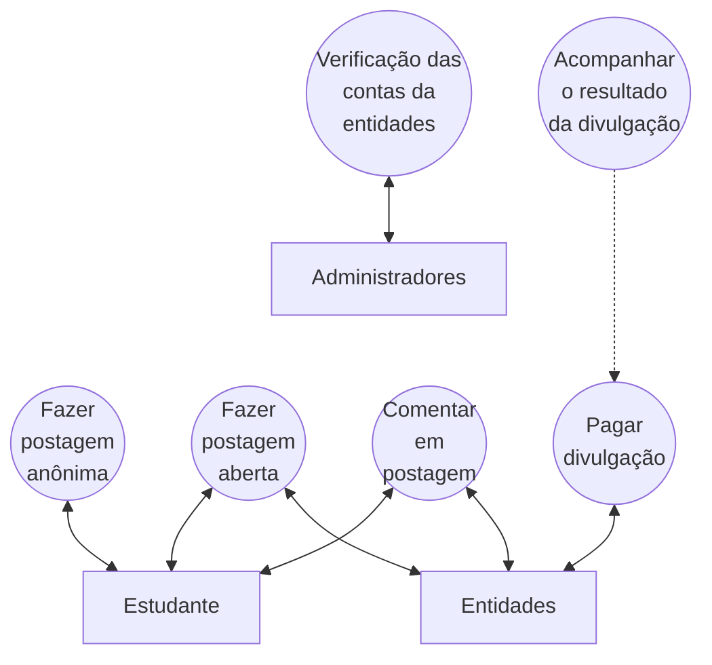

# TrabalhoSistemasOperacionais
 Conversor de endereço lógico em físico

```mermaid
flowchart TD
 Ator1[Estudante]
 Ator2[Entidades]
 Ator3[Administradores]
 Func1((Fazer \n postagem \n anônima))<-->Ator1
 Func2((Fazer \n postagem \n aberta))<-->Ator1
 Func2<-->Ator2
 Func3((Comentar \n em \n postagem))<-->Ator1
 Func3<-->Ator2
 Func4((Pagar \n divulgação))<-->Ator2
 Func4_2((Acompanhar \n o resultado \n da divulgação))-..-> Func4
 Func5((Verificação das \n contas da \n entidades))<-->Ator3
```
